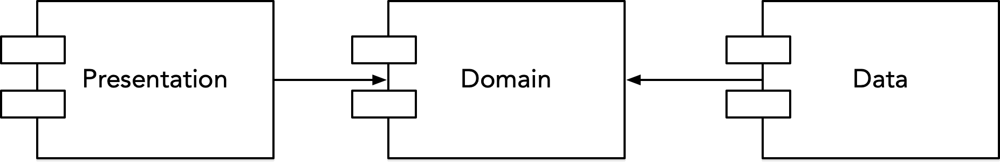

# Savvycom iOS Base (MVVM + Clean Architecture)

## High level overview

## Dependency Direction

## Presentation layer
1. ViewController / View
Responsible for UI and interaction.
It doesn't draw the UI spontaneously, it draws when notified by the Presenter.

2. ViewModel
Subscribe to the declaration described in UseCase , synthesize and process, and generate UI drawing data. (presentation logic)

3. Coordinator
Responsible for page movement.

## Domain layer
1. UseCase
Aggregate business logic. (No need to be conscious of UI)
Receive an Observable Entity from the Data layer and convert it to a Model for the Presentation layer.
I basically don't subscribe here. Declaration is the key.

2. Repository
I/F for accessing the data layer.

## Data layer
1. Repository
Implement repository from Domain.
2. DataStore (Network/Local/Entity)
Get data from Network or Local and return Entity (value object) wrapped in Observable.
The Entity generated here will not be used in the Presentation layer. (Thing completely detached from the page)
2. Translater / Model(ViewModel)
Convert to Model used in Presentation layer.
Model also has properties for View and is also the type class of ViewModel.

## Configure
externally located. Loosely coupled with dependency injection.
(Protocol is prepared in Coordinator, UseCase, Repository this time, but please prepare it where you think it is necessary)
